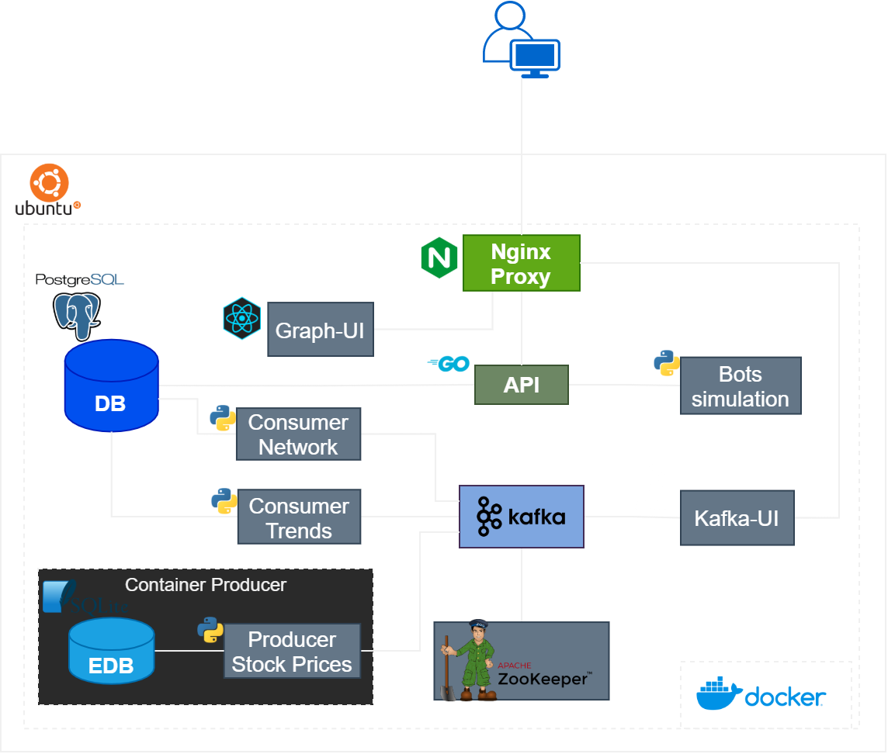

# RealStockInsight: Financial Co-Movements Network Project

🌍 *[Português](README.md) ∙ [English](README_en.md)*

## Introduction

In this repository, you will find some [examples](./examples) and a [project](./project) that have been developed for exploration and learning of some technologies associated with Cloud Computing. Feel free to explore the code and contribute!

## Project Description

The goal is to create an application focused on analyzing the financial market through complex networks, revealing connections, and providing insights into interactions among market actions. [This project](./project) involves building a distributed application to capture, process, and visualize financial data, representing them as an interactive network of co-movements. Using a container-based architecture, the application is divided into several parts that manage the collection, processing, and visualization of financial data.

## Technologies Used

- **Apache Kafka:** To manage real-time data streams.
- **Docker:** To ensure the portability and replicability of the development and execution environment.
- **Python:** Used in Kafka producer and consumer services.
- **Networkx:** Python library for the study of complex networks.
- **Golang:** For API implementation.
- **React:** For UI implementation.
- **PostgreSQL:** To store various data.
- **Stock Market APIs:** For real-time market data collection.
- **Apache Cassandra:** Not used in the current version, but there are some tests done with this type of database to store complex networks. [See examples](./examples/Cassandra_DB)

## Topology

The following diagram provides an overview of the system's topology:

  
## Repository Structure

- `/doc`: Project documentation, including specifications and design.
- `/examples`: Elementary examples of how to use some of the technologies involved in the project.
- `/project`: Contains all projects and modules associated with RealStockInsight.

## How to Use

Usage instructions are thoroughly outlined in the `README` files of the examples. You can find guidance on debugging and configuring the environment using Docker in the [README](./project/README.md) located in the `project` directory.

## User Interface

Check out the following image for the user interface developed with the D3 library.

  

---

## License

This project is licensed under the [MIT License](LICENSE).

---

## Contribution

Contributions are always welcome! To contribute:

1. Fork the project.
2. Create a new branch for your modifications (`git checkout -b feature/AmazingFeature`).
3. Commit your changes (`git commit -m 'Add some AmazingFeature'`).
4. Push to the branch (`git push origin feature/AmazingFeature`).
5. Open a Pull Request.

---