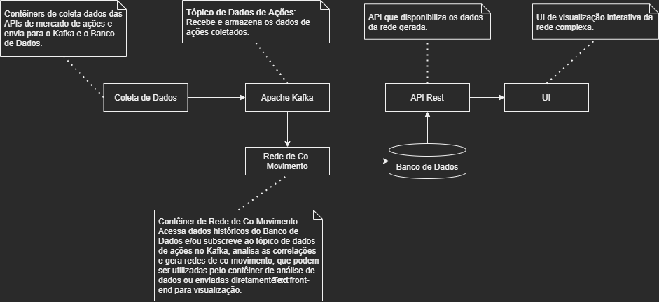
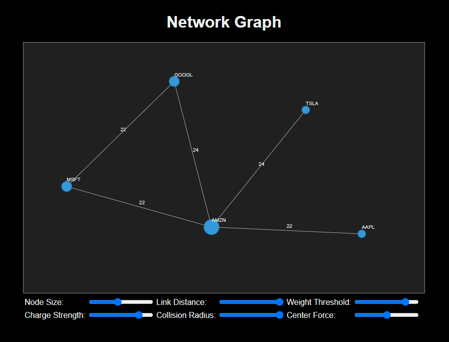

# RealStockInsight: Projeto de Rede de Co-Movimentos Financeiros

🌍 *[**Português**](README_pt.md) ∙ [English](README.md)*

## Apresentação

Neste repositório, você encontrará alguns [exemplos](./examples) e um [projeto](./project) que foram desenvolvidos para exploração e aprendizado de algumas tecnologias associadas à Computação em Nuvem e Redes Complexas.  Seja bem-vindo e sinta-se à vontade para explorar o código e contribuir!

## Descrição do Projeto

O objetivo é criar uma aplicação voltada à análise do mercado financeiro por meio de redes complexas, revelando conexões e fornecendo *insights* sobre as interações entre as ações do mercado. [Este projeto](./project) envolve a construção de uma aplicação distribuída para capturar, processar e visualizar dados financeiros, representando-os como uma rede de co-movimentos interativa. Utilizando uma arquitetura baseada containers, a aplicação é dividida em várias partes que gerenciam a coleta, o processamento e a visualização dos dados financeiros.

## Tecnologias Utilizadas

- **Apache Kafka:** Para gerenciar fluxos de dados em tempo real.- **Docker:** Para garantir a portabilidade e replicabilidade do ambiente de desenvolvimento e execução.
- **Python:** Utilizados nos serviços produtores e consumidores do Kafka.
- **Networkx:** Biblioteca Python para estudo de redes complexas.
- **Golang:** Para implementação API.
- **React:** Para implementaçaõ UI.
- **PostgreSQL:** Para armazenar dados diversos.
- **APIs de Mercado de Ações:** Para coleta de dados em tempo real do mercado.
- **Apache Cassandra:** Na versão atual não é utilizado, mas deixei alguns testes realizados com este tipo de banco de dados para armazenar as redes complexas. [Veja os exemplos](./examples/Cassandra_DB)

## Topologia

O diagrama a seguir oferece uma visão geral da topologia do sistema:

  
## Estrutura do Repositório

- `/doc`: Documentação do projeto, incluindo especificações e design.
- `/examples`: Exemplos elementares de como utilizar algumas das tecnologias envolvidas no projeto.
- `/project`: Contém todos os projetos e módulos associados ao RealStockInsight.

## Como Usar

As instruções de uso são detalhadamente delineadas nos arquivos `README` dos exemplos. Você pode encontrar orientações sobre depuração e configuração do ambiente utilizando Docker no [README](./project/README.md) localizado no diretório `project`.

## Interface com usuário

Confira na imagem a seguir a interface do usuário desenvolvida com a biblioteca D3.

  

---

## Licença

Este projeto está licenciado sob a [Licença MIT](LICENSE).

---

## Contribuição

Contribuições são sempre bem-vindas! Para contribuir:

1. Faça um fork do projeto.
2. Crie uma nova branch para suas modificações (`git checkout -b feature/AmazingFeature`).
3. Faça commit de suas alterações (`git commit -m 'Add some AmazingFeature'`).
4. Faça push para a branch (`git push origin feature/AmazingFeature`).
5. Abra um Pull Request.

---

